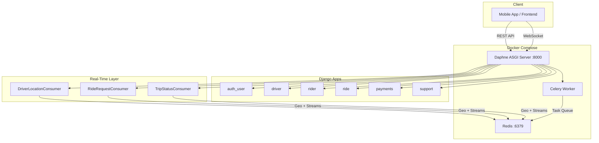
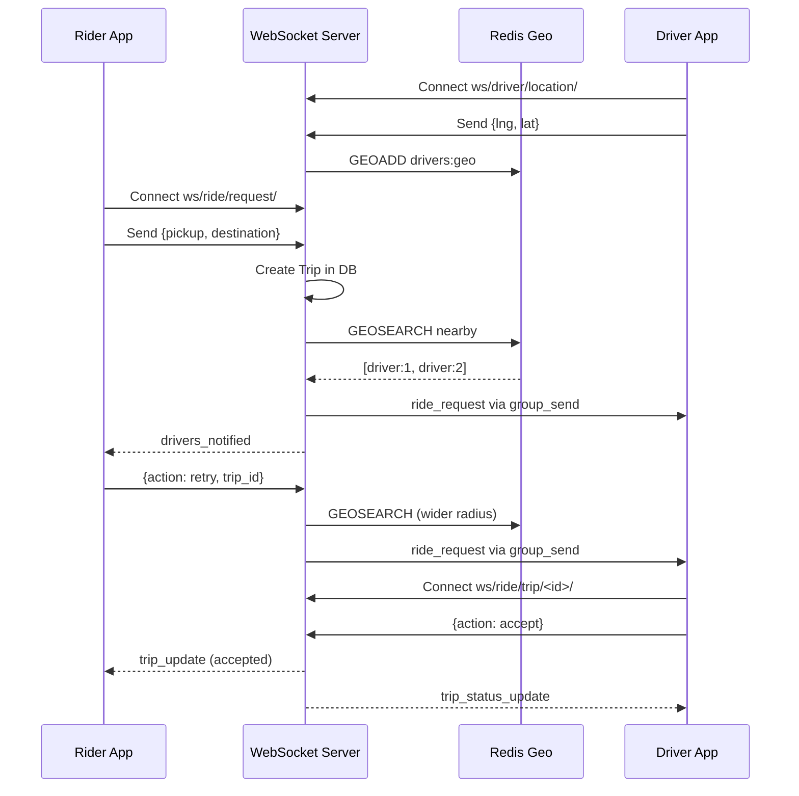
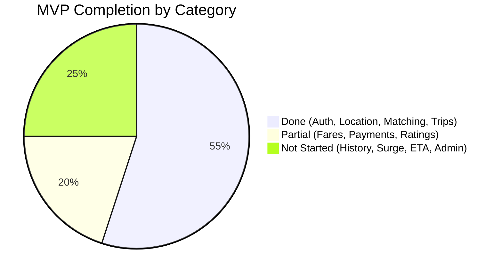

# VahanGoBase — Implementation Report

## Project Overview

VahanGoBase is a **ride-hailing backend** built with Django, supporting real-time driver-rider matching via WebSockets, geospatial driver search via Redis, and a full REST API for auth, rides, payments, and support.

---

## Architecture



---

## Technology Stack

| Layer | Technology |
|---|---|
| Framework | Django 6.0 + Django REST Framework |
| ASGI Server | Daphne |
| WebSockets | Django Channels |
| Cache / Geo / Streams | Redis (3 databases: cache, geo, streams) |
| Auth | SimpleJWT (access + refresh tokens) |
| Task Queue | Celery |
| Containerization | Docker Compose |
| Database | SQLite (dev) |

---

## Django Apps & Models (17 total)

### 1. `auth_user` — Custom User & Authentication

| File | Lines | Description |
|---|---|---|
| [models.py](file:///c:/Users/ankam/OneDrive/Desktop/Backend/VahanGoBase/servers/auth_user/models.py) | 27 | `customUser` model extending `AbstractUser` |
| [views.py](file:///c:/Users/ankam/OneDrive/Desktop/Backend/VahanGoBase/servers/auth_user/views.py) | 481 | Auth endpoints |
| [usermanager.py](file:///c:/Users/ankam/OneDrive/Desktop/Backend/VahanGoBase/servers/auth_user/usermanager.py) | — | Custom user manager |

**Model — `customUser`**
- Phone-based authentication (`USERNAME_FIELD = 'phone_number'`)
- Fields: `full_name`, `phone_number`, `email`, `gender`, `dob`, address fields, `emergency_contact`, `role` (rider/driver/admin), `avatar`

**API Endpoints:**
| Endpoint | Function | Description |
|---|---|---|
| `POST /request-otp/` | `request_otp` | Send OTP to phone via AWS SNS |
| `POST /login/` | `login` | Verify OTP, issue JWT tokens, auto-create Rider/Driver profile |
| `POST /refresh/` | `refresh` | Refresh expired access token |
| `PATCH /update-user/` | `update_user` | Update user profile fields |

---

### 2. `driver` — Driver Profiles, Vehicles & Earnings

| File | Lines | Description |
|---|---|---|
| [models.py](file:///c:/Users/ankam/OneDrive/Desktop/Backend/VahanGoBase/servers/driver/models.py) | 45 | 4 models |
| [views.py](file:///c:/Users/ankam/OneDrive/Desktop/Backend/VahanGoBase/servers/driver/views.py) | 150 | Location management endpoints |
| [utils.py](file:///c:/Users/ankam/OneDrive/Desktop/Backend/VahanGoBase/servers/driver/utils.py) | 44 | Redis stream for location logging |
| [permissions.py](file:///c:/Users/ankam/OneDrive/Desktop/Backend/VahanGoBase/servers/driver/permissions.py) | — | `IsDriver` permission class |

**Models:**

| Model | Key Fields |
|---|---|
| `Driver` | `user_id` (1:1 → User), `license_doc`, `license_expiry`, `status` (online/off/active/on ride/blocked), `total_trips`, `ratings` |
| `VehicleType` | `type` (e.g. sedan, SUV), `description` |
| `Vehicle` | `driver_id` (FK → Driver), `vehicle_type_id`, `brand`, `model`, `color`, `year`, `vehicle_number`, `capacity`, `status` |
| `DriverEarning` | `driver_id`, `trip_id`, `commission`, `net_amount` |

**API Endpoints:**
| Endpoint | Function | Description |
|---|---|---|
| `POST /add-driver/` | `add_driver` | Add driver to Redis Geo index |
| `POST /update-location/` | `update_location` | Update driver coordinates |
| `DELETE /remove-driver/` | `remove_driver_view` | Remove driver from Geo index |

---

### 3. `rider` — Rider Profiles, Wallets & Notifications

[models.py](file:///c:/Users/ankam/OneDrive/Desktop/Backend/VahanGoBase/servers/rider/models.py) — 29 lines, 4 models

| Model | Key Fields |
|---|---|
| `Rider` | `user_id` (1:1 → User), `rating` |
| `FavoritePlace` | `user_id`, `address_text`, `latitude`, `longitude` |
| `Wallet` | `user_id` (1:1), `balance` |
| `Notification` | `user_id`, `title`, `message`, `is_read` |

---

### 4. `ride` — Trips, Fares & Ratings

| File | Lines | Description |
|---|---|---|
| [models.py](file:///c:/Users/ankam/OneDrive/Desktop/Backend/VahanGoBase/servers/ride/models.py) | 66 | 5 models |
| [views.py](file:///c:/Users/ankam/OneDrive/Desktop/Backend/VahanGoBase/servers/ride/views.py) | 118 | Ride request REST endpoint |
| [utils.py](file:///c:/Users/ankam/OneDrive/Desktop/Backend/VahanGoBase/servers/ride/utils.py) | 39 | Fare estimation logic |

**Models:**

| Model | Key Fields |
|---|---|
| `TripStatus` | `status_code` (accepted/in_progress/completed/cancelled) |
| `Trip` | `user_id`, `driver_id`, `vehicle_id`, `status_id`, timestamps (`requested_at`, `accepted_at`, `started_at`, `completed_at`, `cancelled_at`), pickup/destination coords + addresses, `estimated_fare`, `final_fare`, `surge_multiplier`, `payment_method`, `payment_status` |
| `FarePricing` | Per-trip fare breakdown: `base_fare`, `distance_fare`, `time_fare`, `surge_multiplier`, `total_fare` |
| `VehicleFarePricing` | Per-vehicle-type pricing: `base_fare`, `per_km_fare`, `per_min_fare`, `min_fare`, `night_surge_multiplier` |
| `Rating` | `trip_id`, `rater_id`, `score`, `comments` |

**Fare Estimation** (`estimate_amount`): Placeholder using constants (₹30 base + ₹12/km + ₹2/min, ₹50 minimum). Designed to later integrate with Google Maps / OSRM + `VehicleFarePricing` from DB.

---

### 5. `payments` — Payments & Transactions

[models.py](file:///c:/Users/ankam/OneDrive/Desktop/Backend/VahanGoBase/servers/payments/models.py) — 34 lines, 2 models

| Model | Key Fields |
|---|---|
| `Payment` | `trip_id`, `user_id`, `amount`, `method` (cash/online), `driver_txn_id`, `status` (processing/completed) |
| `TransactionHistory` | `trip_id`, `user_id`, `driver_id`, `amount`, `method`, `user_txn_id`, `status` |

---

### 6. `support` — Support Tickets

[models.py](file:///c:/Users/ankam/OneDrive/Desktop/Backend/VahanGoBase/servers/support/models.py) — 17 lines, 1 model

| Model | Key Fields |
|---|---|
| `SupportTicket` | `user_id`, `trip_id` (optional), `issue_type`, `status` (OPEN/CLOSED), `description`, `created_at`, `resolved_at` |

---

## Real-Time System (WebSockets + Redis)

### Redis Layer — [redis.py](file:///c:/Users/ankam/OneDrive/Desktop/Backend/VahanGoBase/servers/redis.py) (249 lines)

Uses **Redis DB/2** for geospatial operations:

| Function | Redis Command | Purpose |
|---|---|---|
| `add_driver_location` | `GEOADD drivers:geo` | Store driver position in geo index |
| `nearby_drivers` | `GEOSEARCH drivers:geo` | Find drivers within radius (default 1km) |
| `remove_driver` | `ZREM drivers:geo` | Remove driver from index on disconnect |
| `publish_ride_request` | `XADD ride_requests` | Log ride request to stream (future analytics placeholder) |

### Driver Location Stream — [utils.py](file:///c:/Users/ankam/OneDrive/Desktop/Backend/VahanGoBase/servers/driver/utils.py) (44 lines)

Uses **Redis DB/3** — `XADD driver_location_stream` to log every driver location update (analytics placeholder).

### WebSocket Consumers — [consumers.py](file:///c:/Users/ankam/OneDrive/Desktop/Backend/VahanGoBase/servers/consumers.py) (640+ lines)



#### Consumer 1: `DriverLocationConsumer`
- **Route:** `ws/driver/location/`
- **Auth:** JWT via query param
- **Groups:** `driver_{id}` (personal) + `online_drivers` (global)
- **Receive:** `{lng, lat}` → updates Redis Geo + location stream
- **Events:** Listens for incoming `ride_request` messages from channel layer

#### Consumer 2: `RideRequestConsumer`
- **Route:** `ws/ride/request/`
- **Auth:** JWT via query param
- **Groups:** `rider_{user_id}` (personal)
- **New request flow:** Creates Trip → `GEOSEARCH` nearby → `group_send` to each driver
- **Retry flow:** `{action: "retry", trip_id, radius?}` → re-searches + re-notifies
- **Shared helper:** `_notify_nearby_drivers()` used by both flows

#### Consumer 3: `TripStatusConsumer`
- **Route:** `ws/ride/trip/<trip_id>/`
- **Auth:** JWT + trip participant check
- **Groups:** `trip_{id}` (shared between rider & driver)
- **Actions:** `accept`, `start`, `complete`, `cancel` — updates Trip in DB + broadcasts to group

### JWT WebSocket Middleware — [ws_middleware.py](file:///c:/Users/ankam/OneDrive/Desktop/Backend/VahanGoBase/servers/ws_middleware.py) (52 lines)

`JWTAuthMiddleware` extracts JWT from `?token=` query param, validates via SimpleJWT `AccessToken`, and injects `scope['user']`.

### Routing — [routing.py](file:///c:/Users/ankam/OneDrive/Desktop/Backend/VahanGoBase/servers/routing.py) (9 lines)

3 WebSocket URL patterns mapped to the consumers.

---

## Infrastructure

### Docker Compose — [docker-compose.yml](file:///c:/Users/ankam/OneDrive/Desktop/Backend/VahanGoBase/docker-compose.yml)

| Service | Image | Purpose |
|---|---|---|
| `redis` | `redis:latest` | Cache, Geo index, Streams, Channel layer |
| `django` | Custom Dockerfile | Daphne ASGI server on port 8000 |
| `celery` | Same Dockerfile | Background task worker |

### ASGI Config — [asgi.py](file:///c:/Users/ankam/OneDrive/Desktop/Backend/VahanGoBase/base/asgi.py)

`ProtocolTypeRouter` splits HTTP (Django views) and WebSocket (Channels + JWT middleware) traffic.

---

## Code Summary

| Component | Files | Total Lines (approx) |
|---|---|---|
| `auth_user` (models, views, serializers, urls, usermanager) | 5 | ~550 |
| `driver` (models, views, utils, permissions, urls) | 5 | ~240 |
| `rider` (models, views, serializers, urls) | 4 | ~100 |
| `ride` (models, views, utils, urls) | 4 | ~225 |
| `payments` (models) | 1 | ~34 |
| `support` (models) | 1 | ~17 |
| Real-time: `consumers.py` | 1 | ~640 |
| Real-time: `redis.py` | 1 | ~249 |
| Real-time: `ws_middleware.py` | 1 | ~52 |
| Real-time: `routing.py` | 1 | ~9 |
| Config: `asgi.py`, `settings.py`, `docker-compose.yml` | 3 | ~60 |
| **Total** | **~27** | **~2,100+** |

---

## MVP Progress — Ride-Hailing Backend

### Overall: ~55% Complete

```
██████████████░░░░░░░░░░░░  55%
```

### Per-Feature Breakdown

| # | MVP Feature | Status | Done % | Notes |
|---|---|---|---|---|
| 1 | **User Auth (OTP + JWT)** | ✅ Done | 100% | Phone-based OTP, JWT access/refresh, role-based login |
| 2 | **User Profile CRUD** | ✅ Done | 100% | Update name, email, avatar, address, etc. |
| 3 | **Driver Profile & Vehicle Registration** | ✅ Done | 90% | Models + admin; missing REST CRUD for vehicle management |
| 4 | **Real-Time Driver Location Tracking** | ✅ Done | 100% | WebSocket + REST → Redis Geo + stream log |
| 5 | **Nearby Driver Search** | ✅ Done | 100% | `GEOSEARCH` with configurable radius, sorted by distance |
| 6 | **Ride Request + Driver Matching** | ✅ Done | 95% | WebSocket + REST; auto-notify nearby drivers; retry with wider radius |
| 7 | **Trip Lifecycle (accept/start/complete/cancel)** | ✅ Done | 90% | Real-time status via WebSocket; missing timeout auto-cancel |
| 8 | **Fare Estimation** | 🟡 Partial | 30% | Hardcoded constants; needs Google Maps/OSRM distance + `VehicleFarePricing` DB lookup |
| 9 | **Payment Processing** | 🟡 Models Only | 15% | `Payment` + `TransactionHistory` models exist; no gateway (Razorpay/Stripe) integration |
| 10 | **Ratings & Reviews** | 🟡 Models Only | 15% | `Rating` model exists; no API endpoints |
| 11 | **Push Notifications (FCM/APNs)** | 🟡 Models Only | 10% | `Notification` model exists; no FCM/APNs delivery |
| 12 | **Ride History** | 🔲 Not Started | 0% | Trip data exists in DB; no list/detail endpoints for rider/driver |
| 13 | **Driver Earnings Dashboard** | 🟡 Models Only | 15% | `DriverEarning` model exists; no calculation logic or API |
| 14 | **Support Tickets** | 🟡 Models Only | 15% | `SupportTicket` model exists; no CRUD endpoints |
| 15 | **Surge Pricing** | 🔲 Not Started | 0% | `surge_multiplier` field exists on Trip; no calculation logic |
| 16 | **ETA Calculation** | 🔲 Not Started | 0% | Needs routing API integration |
| 17 | **Admin Dashboard APIs** | 🔲 Not Started | 0% | Django admin registered; no custom admin APIs |
| 18 | **Deployment (Production)** | 🟡 Partial | 40% | Docker Compose + Daphne works; needs PostgreSQL, env configs, HTTPS, CI/CD |

---

### What's Done vs What's Left



### Remaining Work — Priority Order

| Priority | Feature | Effort | What Needs To Be Done |
|---|---|---|---|
| 🔴 P0 | **Fare Estimation (real)** | ~1 day | Integrate Google Maps Distance Matrix API for distance/duration; use `VehicleFarePricing` from DB instead of hardcoded constants |
| 🔴 P0 | **Payment Gateway** | ~2-3 days | Integrate Razorpay/Stripe; create order on trip complete; webhook for payment confirmation; update `Payment` + `TransactionHistory` |
| 🔴 P0 | **Ride History API** | ~0.5 day | GET endpoints for rider's past trips + driver's past trips with pagination |
| 🟠 P1 | **Ratings API** | ~0.5 day | POST rating after trip completion; GET average rating; update Driver/Rider `rating` fields |
| 🟠 P1 | **Push Notifications** | ~1 day | Firebase Admin SDK; send push on ride request, trip accepted, trip completed; Celery task for async delivery |
| 🟠 P1 | **Trip Timeout Auto-Cancel** | ~0.5 day | Celery delayed task: if no driver accepts within X minutes, auto-cancel trip and notify rider |
| 🟠 P1 | **Driver Earnings** | ~0.5 day | Calculate commission on trip complete; populate `DriverEarning`; GET endpoint for earnings summary |
| 🟠 P1 | **Vehicle CRUD API** | ~0.5 day | REST endpoints for drivers to add/update/remove vehicles |
| 🟡 P2 | **Surge Pricing** | ~1 day | Calculate demand/supply ratio per area; apply multiplier to fare |
| 🟡 P2 | **ETA Calculation** | ~0.5 day | Google Maps Directions API for pickup ETA + trip ETA |
| 🟡 P2 | **Support Ticket CRUD** | ~0.5 day | Create/list/update ticket endpoints |
| 🟡 P2 | **Admin Dashboard APIs** | ~2 days | User management, trip monitoring, revenue reports, driver approval |
| 🟢 P3 | **Production Deployment** | ~1-2 days | PostgreSQL, environment configs, HTTPS/nginx, CI/CD pipeline |

> **Estimated remaining effort for full MVP: ~12-15 days**
