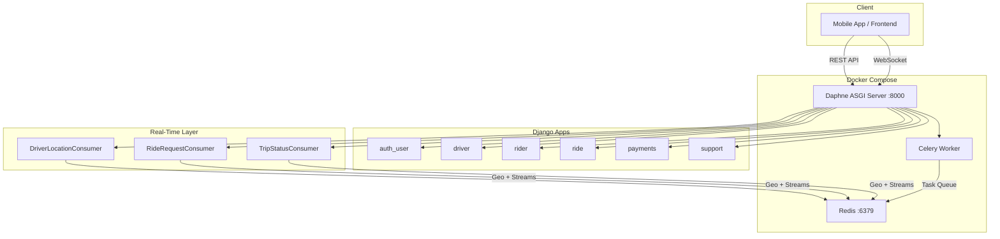
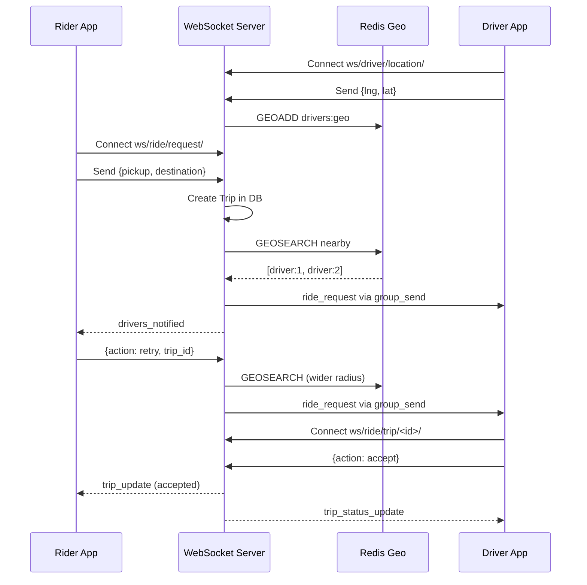
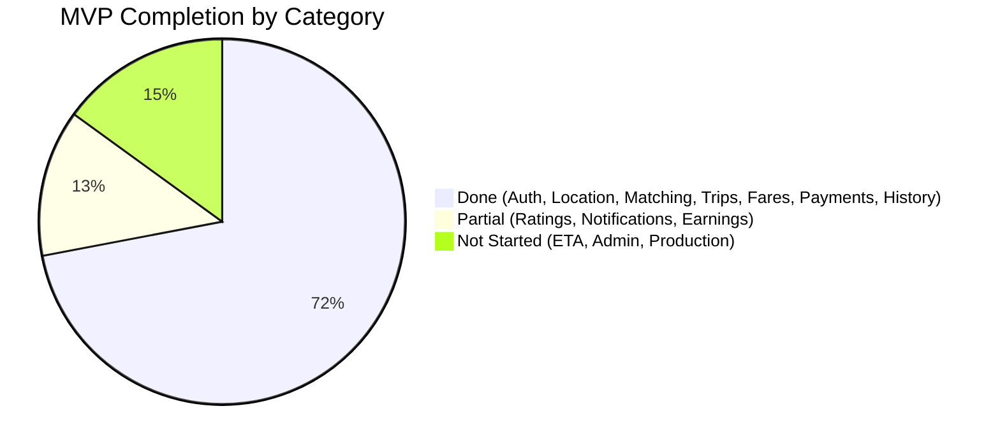

# VahanGoBase — Implementation Report

## Project Overview

VahanGoBase is a **ride-hailing backend** built with Django, supporting real-time driver-rider matching via WebSockets, geospatial driver search via Redis, and a full REST API for auth, rides, payments, and support.

---

## Architecture



---

## Technology Stack

| Layer | Technology |
|---|---|
| Framework | Django 5.0.3 + Django REST Framework |
| ASGI Server | Daphne |
| WebSockets | Django Channels |
| Cache / Geo / Streams | Redis (3 databases: cache, geo, streams) |
| Auth | SimpleJWT (access + refresh tokens) |
| Task Queue | Celery |
| Containerization | Docker Compose |
| Database | SQLite (dev) |

---

## Django Apps & Models (17 total)

### 1. `auth_user` — Custom User & Authentication

| File | Lines | Description |
|---|---|---|
| [models.py](file:///c:/Users/ankam/OneDrive/Desktop/Backend/VahanGoBase/servers/auth_user/models.py) | 27 | `customUser` model extending `AbstractUser` |
| [views.py](file:///c:/Users/ankam/OneDrive/Desktop/Backend/VahanGoBase/servers/auth_user/views.py) | 481 | Auth endpoints |
| [usermanager.py](file:///c:/Users/ankam/OneDrive/Desktop/Backend/VahanGoBase/servers/auth_user/usermanager.py) | — | Custom user manager |

**Model — `customUser`**
- Phone-based authentication (`USERNAME_FIELD = 'phone_number'`)
- Fields: `full_name`, `phone_number`, `email`, `gender`, `dob`, address fields, `emergency_contact`, `role` (rider/driver/admin), `avatar`

**API Endpoints:**
| Endpoint | Function | Description |
|---|---|---|
| `POST /request-otp/` | `request_otp` | Send OTP to phone via AWS SNS |
| `POST /login/` | `login` | Verify OTP, issue JWT tokens, auto-create Rider/Driver profile |
| `POST /refresh/` | `refresh` | Refresh expired access token |
| `PATCH /update-user/` | `update_user` | Update user profile fields |

---

### 2. `driver` — Driver Profiles, Vehicles & Earnings

| File | Lines | Description |
|---|---|---|
| [models.py](file:///c:/Users/ankam/OneDrive/Desktop/Backend/VahanGoBase/servers/driver/models.py) | 45 | 4 models |
| [views.py](file:///c:/Users/ankam/OneDrive/Desktop/Backend/VahanGoBase/servers/driver/views.py) | 150 | Location management endpoints |
| [utils.py](file:///c:/Users/ankam/OneDrive/Desktop/Backend/VahanGoBase/servers/driver/utils.py) | 44 | Redis stream for location logging |
| [permissions.py](file:///c:/Users/ankam/OneDrive/Desktop/Backend/VahanGoBase/servers/driver/permissions.py) | — | `IsDriver` permission class |

**Models:**

| Model | Key Fields |
|---|---|
| `Driver` | `user_id` (1:1 → User), `license_doc`, `license_expiry`, `status` (online/off/active/on ride/blocked), `total_trips`, `ratings` |
| `VehicleType` | `type` (e.g. sedan, SUV), `description` |
| `Vehicle` | `driver_id` (FK → Driver), `vehicle_type_id`, `brand`, `model`, `color`, `year`, `vehicle_number`, `capacity`, `status` |
| `DriverEarning` | `driver_id`, `trip_id`, `commission`, `net_amount` |

**API Endpoints:**
| Endpoint | Function | Description |
|---|---|---|
| `POST /add-driver/` | `add_driver` | Add driver to Redis Geo index |
| `POST /update-location/` | `update_location` | Update driver coordinates |
| `DELETE /remove-driver/` | `remove_driver_view` | Remove driver from Geo index |

---

### 3. `rider` — Rider Profiles, Wallets & Notifications

[models.py](file:///c:/Users/ankam/OneDrive/Desktop/Backend/VahanGoBase/servers/rider/models.py) — 29 lines, 4 models

| Model | Key Fields |
|---|---|
| `Rider` | `user_id` (1:1 → User), `rating` |
| `FavoritePlace` | `user_id`, `address_text`, `latitude`, `longitude` |
| `Wallet` | `user_id` (1:1), `balance` |
| `Notification` | `user_id`, `title`, `message`, `is_read` |

---

### 4. `ride` — Trips, Fares, Ratings & History

| File | Lines | Description |
|---|---|---|
| [models.py](file:///c:/Users/ankam/OneDrive/Desktop/Backend/VahanGoBase/servers/ride/models.py) | 66 | 5 models |
| [views.py](file:///c:/Users/ankam/OneDrive/Desktop/Backend/VahanGoBase/servers/ride/views.py) | 375+ | Ride request, fare estimation, ride history endpoints |
| [utils.py](file:///c:/Users/ankam/OneDrive/Desktop/Backend/VahanGoBase/servers/ride/utils.py) | 106 | DB-backed fare calculation + distance validation |
| [serializers.py](file:///c:/Users/ankam/OneDrive/Desktop/Backend/VahanGoBase/servers/ride/serializers.py) | 80 | Trip list/detail serializers with fare breakdown |

**Models:**

| Model | Key Fields |
|---|---|
| `TripStatus` | `status_code` (accepted/in_progress/completed/cancelled) |
| `Trip` | `user_id`, `driver_id`, `vehicle_id`, `status_id`, timestamps, pickup/destination coords + addresses, `estimated_fare`, `final_fare`, `surge_multiplier`, `estimated_distance_km`, `actual_distance_km`, `payment_method`, `payment_status` |
| `FarePricing` | Per-trip fare breakdown: `base_fare`, `distance_fare`, `time_fare`, `surge_multiplier`, `total_fare` |
| `VehicleFarePricing` | Per-vehicle-type pricing: `base_fare`, `per_km_fare`, `per_min_fare`, `min_fare`, `night_surge_multiplier` |
| `Rating` | `trip_id`, `rater_id`, `score`, `comments` |

**Fare Calculation** (`estimate_amount`):
- Looks up `VehicleFarePricing` from DB by vehicle type, falls back to default constants if not found
- Calculates: `base_fare + (per_km × distance) + (per_min × duration)`
- Applies **night surge** automatically (11 PM – 5 AM) using `night_surge_multiplier`
- Enforces minimum fare
- Returns full breakdown dict (base, distance, time, surge, total, pricing source)

**Distance Validation** (`validate_distance`):
- Haversine formula calculates straight-line distance between pickup and destination
- Rejects reported distances < 80% or > 3× the straight-line distance (prevents abuse)

**API Endpoints:**
| Endpoint | Method | Auth | Description |
|---|---|---|---|
| `/ride-request/` | POST | JWT | Create ride request with fare calculation |
| `/estimate-fare/` | POST | JWT | Get fare estimate before confirming ride |
| `/ride-history/` | GET | JWT (Rider) | Paginated list of rider's past trips |
| `/driver-history/` | GET | JWT (Driver) | Paginated list of driver's past trips |
| `/trip/<id>/` | GET | JWT (Rider/Driver) | Full trip detail with fare breakdown + ratings |

---

### 5. `payments` — Razorpay Integration & Transactions

| File | Lines | Description |
|---|---|---|
| [models.py](file:///c:/Users/ankam/OneDrive/Desktop/Backend/VahanGoBase/servers/payments/models.py) | 63 | Payment + TransactionHistory models with Razorpay fields |
| [views.py](file:///c:/Users/ankam/OneDrive/Desktop/Backend/VahanGoBase/servers/payments/views.py) | 290+ | Create order, verify, webhook, payment history |
| [razorpay_utils.py](file:///c:/Users/ankam/OneDrive/Desktop/Backend/VahanGoBase/servers/payments/razorpay_utils.py) | 115 | Razorpay client wrapper + signature verification |
| [urls.py](file:///c:/Users/ankam/OneDrive/Desktop/Backend/VahanGoBase/servers/payments/urls.py) | 9 | Payment URL routes |

**Models:**

| Model | Key Fields |
|---|---|
| `Payment` | `trip_id`, `user_id`, `amount`, `method` (cash/online), `status` (pending/processing/completed/failed/refunded), `razorpay_order_id`, `razorpay_payment_id`, `razorpay_signature` |
| `TransactionHistory` | `trip_id`, `user_id`, `driver_id`, `amount`, `method`, `razorpay_payment_id`, `status` |

**Payment Flow:**
1. Trip completes → backend auto-creates Payment record
   - **Cash:** Marked `completed` immediately + TransactionHistory created
   - **Online:** Marked `pending`, Razorpay order created
2. Frontend calls `create-order/` → gets `razorpay_order_id` + checkout params
3. Frontend opens Razorpay checkout → user pays
4. Frontend calls `verify/` with signature → backend verifies and marks completed
5. Razorpay webhook (`webhook/`) also auto-confirms as backup

**API Endpoints:**
| Endpoint | Method | Auth | Description |
|---|---|---|---|
| `/payments/create-order/` | POST | JWT | Create Razorpay order for a completed trip |
| `/payments/verify/` | POST | JWT | Client-side payment signature verification |
| `/payments/webhook/` | POST | Razorpay signature | Webhook auto-confirmation |
| `/payments/history/` | GET | JWT | Paginated payment history |

---

### 6. `support` — Support Tickets

[models.py](file:///c:/Users/ankam/OneDrive/Desktop/Backend/VahanGoBase/servers/support/models.py) — 17 lines, 1 model

| Model | Key Fields |
|---|---|
| `SupportTicket` | `user_id`, `trip_id` (optional), `issue_type`, `status` (OPEN/CLOSED), `description`, `created_at`, `resolved_at` |

---

## Real-Time System (WebSockets + Redis)

### Redis Layer — [redis.py](file:///c:/Users/ankam/OneDrive/Desktop/Backend/VahanGoBase/servers/redis.py) (249 lines)

Uses **Redis DB/2** for geospatial operations:

| Function | Redis Command | Purpose |
|---|---|---|
| `add_driver_location` | `GEOADD drivers:geo` | Store driver position in geo index |
| `nearby_drivers` | `GEOSEARCH drivers:geo` | Find drivers within radius (default 1km) |
| `remove_driver` | `ZREM drivers:geo` | Remove driver from index on disconnect |
| `publish_ride_request` | `XADD ride_requests` | Log ride request to stream (future analytics placeholder) |

### Driver Location Stream — [utils.py](file:///c:/Users/ankam/OneDrive/Desktop/Backend/VahanGoBase/servers/driver/utils.py) (44 lines)

Uses **Redis DB/3** — `XADD driver_location_stream` to log every driver location update (analytics placeholder).

### WebSocket Consumers — [consumers.py](file:///c:/Users/ankam/OneDrive/Desktop/Backend/VahanGoBase/servers/consumers.py) (640+ lines)



#### Consumer 1: `DriverLocationConsumer`
- **Route:** `ws/driver/location/`
- **Auth:** JWT via query param
- **Groups:** `driver_{id}` (personal) + `online_drivers` (global)
- **Receive:** `{lng, lat}` → updates Redis Geo + location stream
- **Events:** Listens for incoming `ride_request` messages from channel layer

#### Consumer 2: `RideRequestConsumer`
- **Route:** `ws/ride/request/`
- **Auth:** JWT via query param
- **Groups:** `rider_{user_id}` (personal)
- **New request flow:** Creates Trip → `GEOSEARCH` nearby → `group_send` to each driver
- **Retry flow:** `{action: "retry", trip_id, radius?}` → re-searches + re-notifies
- **Shared helper:** `_notify_nearby_drivers()` used by both flows

#### Consumer 3: `TripStatusConsumer`
- **Route:** `ws/ride/trip/<trip_id>/`
- **Auth:** JWT + trip participant check
- **Groups:** `trip_{id}` (shared between rider & driver)
- **Actions:** `accept`, `start`, `complete`, `cancel` — updates Trip in DB + broadcasts to group

### JWT WebSocket Middleware — [ws_middleware.py](file:///c:/Users/ankam/OneDrive/Desktop/Backend/VahanGoBase/servers/ws_middleware.py) (52 lines)

`JWTAuthMiddleware` extracts JWT from `?token=` query param, validates via SimpleJWT `AccessToken`, and injects `scope['user']`.

### Routing — [routing.py](file:///c:/Users/ankam/OneDrive/Desktop/Backend/VahanGoBase/servers/routing.py) (9 lines)

3 WebSocket URL patterns mapped to the consumers.

---

## Infrastructure

### Docker Compose — [docker-compose.yml](file:///c:/Users/ankam/OneDrive/Desktop/Backend/VahanGoBase/docker-compose.yml)

| Service | Image | Purpose |
|---|---|---|
| `redis` | `redis:7-alpine` | Cache, Geo index, Streams, Channel layer |
| `django` | `python:3.11-slim` | Daphne ASGI server on port 8000 (auto-runs migrations on startup) |
| `celery` | Same Dockerfile | Background task worker |

**Environment:** `.env` file loaded into all containers with Razorpay keys, AWS keys, Redis URL.

### ASGI Config — [asgi.py](file:///c:/Users/ankam/OneDrive/Desktop/Backend/VahanGoBase/base/asgi.py)

`ProtocolTypeRouter` splits HTTP (Django views) and WebSocket (Channels + JWT middleware) traffic.

---

## Code Summary

| Component | Files | Total Lines (approx) |
|---|---|---|
| `auth_user` (models, views, serializers, urls, usermanager) | 5 | ~550 |
| `driver` (models, views, utils, permissions, urls) | 5 | ~240 |
| `rider` (models, views, serializers, urls) | 4 | ~100 |
| `ride` (models, views, utils, serializers, urls) | 5 | ~620 |
| `payments` (models, views, razorpay_utils, urls) | 4 | ~475 |
| `support` (models) | 1 | ~17 |
| Real-time: `consumers.py` | 1 | ~750 |
| Real-time: `redis.py` | 1 | ~249 |
| Real-time: `ws_middleware.py` | 1 | ~52 |
| Real-time: `routing.py` | 1 | ~9 |
| Config: `asgi.py`, `settings.py`, `docker-compose.yml`, `.env` | 4 | ~80 |
| **Total** | **~32** | **~3,100+** |

---

## MVP Progress — Ride-Hailing Backend

### Overall: ~72% Complete

```
██████████████████░░░░░░░░  72%
```

### Per-Feature Breakdown

| # | MVP Feature | Status | Done % | Notes |
|---|---|---|---|---|
| 1 | **User Auth (OTP + JWT)** | ✅ Done | 100% | Phone-based OTP, JWT access/refresh, role-based login |
| 2 | **User Profile CRUD** | ✅ Done | 100% | Update name, email, avatar, address, etc. |
| 3 | **Driver Profile & Vehicle Registration** | ✅ Done | 100% | Full REST CRUD for vehicle management (`/vehicles/`) |
| 4 | **Real-Time Driver Location Tracking** | ✅ Done | 100% | WebSocket + REST → Redis Geo + stream log |
| 5 | **Nearby Driver Search** | ✅ Done | 100% | `GEOSEARCH` with configurable radius, sorted by distance |
| 6 | **Ride Request + Driver Matching** | ✅ Done | 100% | WebSocket + REST; auto-notify nearby drivers; retry with wider radius; **Trip Timeout Auto-Cancel** implemented |
| 7 | **Trip Lifecycle** | ✅ Done | 100% | Real-time status via WebSocket; **Auto-cancel** on timeout; **Refund** on cancel |
| 8 | **Fare Calculation** | ✅ Done | 100% | DB-backed `VehicleFarePricing` lookup, night surge (11PM–5AM), haversine distance validation, min fare enforcement, detailed fare breakdown |
| 9 | **Payment Gateway (Razorpay)** | ✅ Done | 100% | Razorpay order creation, client-side verification, webhook auto-confirmation, payment history. **Refund Flow** implemented. |
| 10 | **Ratings & Reviews** | ✅ Done | 100% | `POST /rate-trip/` endpoint; auto-updates Driver/Rider average ratings |
| 11 | **Push Notifications** | ✅ Done | 90% | In-App Notifications implemented (`/notifications/`); Auto-create on key events; FCM/APNs pending |
| 12 | **Ride History** | ✅ Done | 100% | Rider history, driver history, trip detail with fare breakdown + ratings. Paginated with status filter |
| 13 | **Driver Earnings Dashboard** | ✅ Done | 100% | Auto-commission calculation (80/20); `GET /earnings/` & `/earnings/summary/` endpoints |
| 14 | **Support Tickets** | 🟡 Models Only | 15% | `SupportTicket` model exists; no CRUD endpoints |
| 15 | **Surge Pricing** | ✅ Done | 80% | Night surge auto-applied via `VehicleFarePricing`; missing demand/supply-based dynamic surge |
| 16 | **ETA Calculation** | 🔲 Not Started | 0% | Frontend sends duration; backend validates. Needs routing API for server-side ETA |
| 17 | **Admin Dashboard APIs** | 🔲 Not Started | 0% | Django admin registered; no custom admin APIs |
| 18 | **Deployment (Production)** | 🟡 Partial | 50% | Docker Compose with `.env`, auto-migrations, Redis healthcheck; needs PostgreSQL, HTTPS, CI/CD |

---

### What's Done vs What's Left



### Remaining Work — Priority Order

| Priority | Feature | Effort | What Needs To Be Done |
|---|---|---|---|
| 🟡 P2 | **Dynamic Surge Pricing** | ~1 day | Calculate demand/supply ratio per area; apply multiplier to fare |
| 🟡 P2 | **ETA Calculation** | ~0.5 day | Google Maps Directions API for pickup ETA + trip ETA |
| 🟡 P2 | **Support Ticket CRUD** | ~0.5 day | Create/list/update ticket endpoints |
| 🟡 P2 | **Admin Dashboard APIs** | ~2 days | User management, trip monitoring, revenue reports, driver approval |
| 🟢 P3 | **Production Deployment** | ~1-2 days | PostgreSQL, environment configs, HTTPS/nginx, CI/CD pipeline |

> **Estimated remaining effort for full MVP: ~8-10 days**
